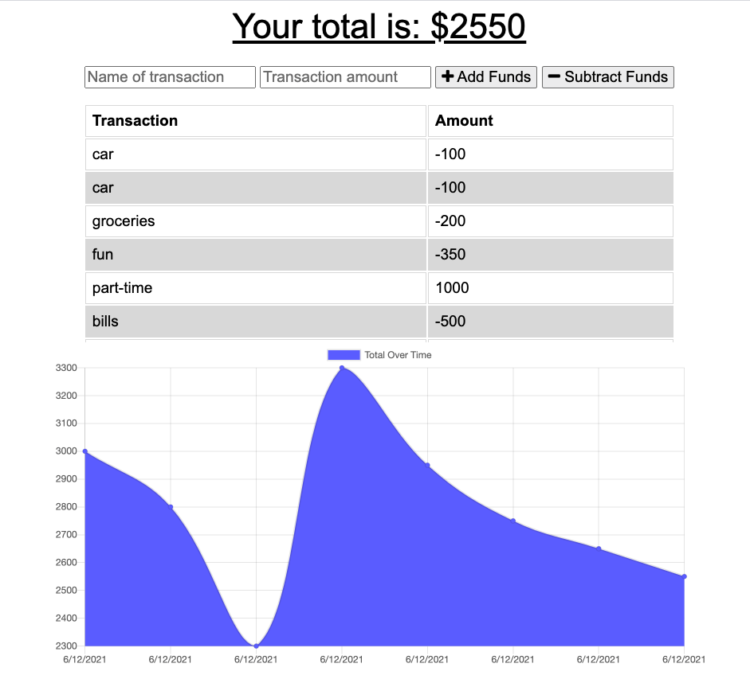
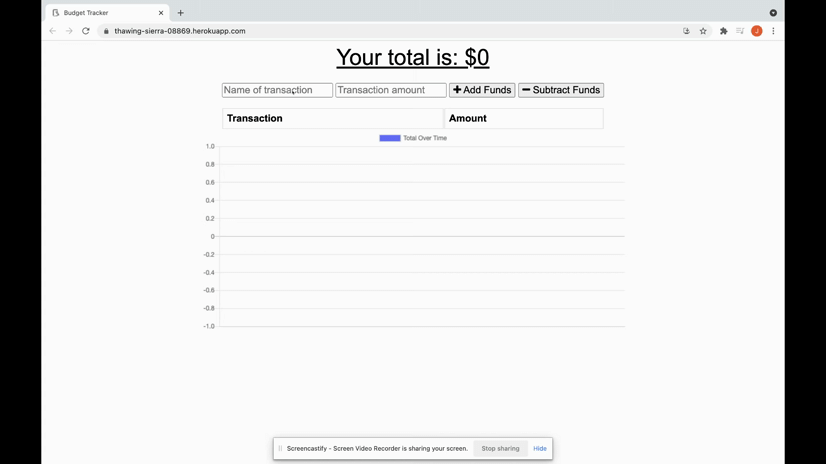

# 18-budget-tracker

## Table of Contents
* [Introduction](#introduction)
* [Functionality](#functionality)
* [Tasks Completed](#tasks-completed)
* [Technologies Used](#technologies-used)
* [Demo](#demo)
* [Sources](#sources)
* [License](#license)

 ## Introduction
User can track a budget that will also save when offline.
* Heroku: https://thawing-sierra-08869.herokuapp.com/
* GitHub: https://github.com/JXIong15/18-budget-tracker

## Functionality
* When the user loads the page, they are shown their current budget tracker.
* User can add or subtrack funds to be displayed in a chart and a graph.
* When offline, the user can still add/subtract funds to be saved in a cache. Once the user goes online again, the cache is automatically updated to reflect in the database and on the chart and graph.

## Tasks Completed
* Dowloaded necessary NPM packages with `npm install` on the Command Line
* Created server.js and necessary folders for development
* Created `manifest.json` to manifest data
* Created `indexDB.js` to connect the index.js to the database, allowing user to display current budget and save budget to cache when offline.
    * referenced routes in `routes/api.js`
* Created `service-worker` to cache the correct documents.
* Created a MongoDB database and collection for the data. Conencted it to deploy on Heroku.

## Technologies Used
* Manifest
* Service-Worker
* Heroku
* MongoDB
* Express

## Demo
* Online App Demo:

* Offline App Demo:

* Mobile App Demo:

## Sources
* NPM Packages: https://www.npmjs.com/
* MongoDB Atlas: https://www.mongodb.com/cloud/atlas
* Robo 3T: https://robomongo.org/
* Heroku: https://devcenter.heroku.com/articles/heroku-cli

## License
Licensed under the [MIT License](LICENSE).

© 2021 Trilogy, Northwestern Coding Bootcamp

